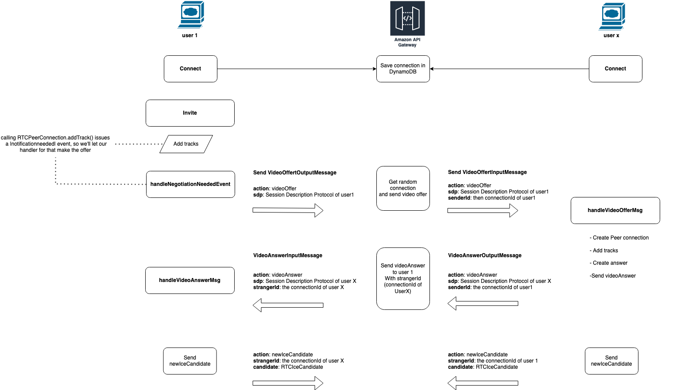

# Signaling and video calling example

POC of Video chat with random user like Omegle (RIP) or ome.tv based on this [example](https://github.com/mdn/samples-server/tree/master/s/webrtc-from-chat)

See WebRTC documentation: [Signaling and video calling](https://developer.mozilla.org/en-US/docs/Web/API/WebRTC_API/Signaling_and_video_calling)

## Signaling transaction flow

## Install
```
pnpm i
```

## Client (ReactJs)
Run ReactJs app locally

```
cd packages/frontend
pnpm run dev
```

## Signaling Server
Aws ApiGateway webSocket.

Create and deploy stack with [SST](https://docs.sst.dev/apis#websocket)
- [How to create web socket api with SST](https://sst.dev/examples/how-to-create-a-websocket-api-with-serverless.html)

### Starting your dev environment
Thanks to [Live lambda development](https://docs.sst.dev/live-lambda-development):
 > Changes are automatically detected, built, and live reloaded in under 10 milliseconds. You can also use breakpoints to debug your functions live with your favorite IDE

```
pnpm run dev
```

### Deploy to prod
```
$ pnpm run deploy --stage prod
```

### Cleaning up
```
$ pnpm run remove
$ pnpm run remove --stage prod
```
