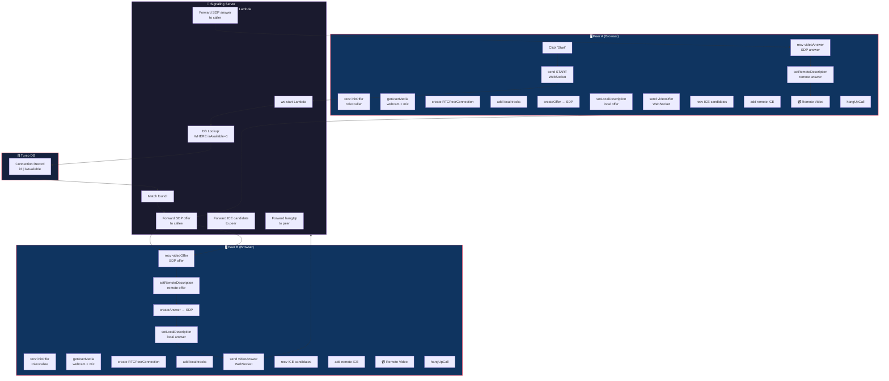
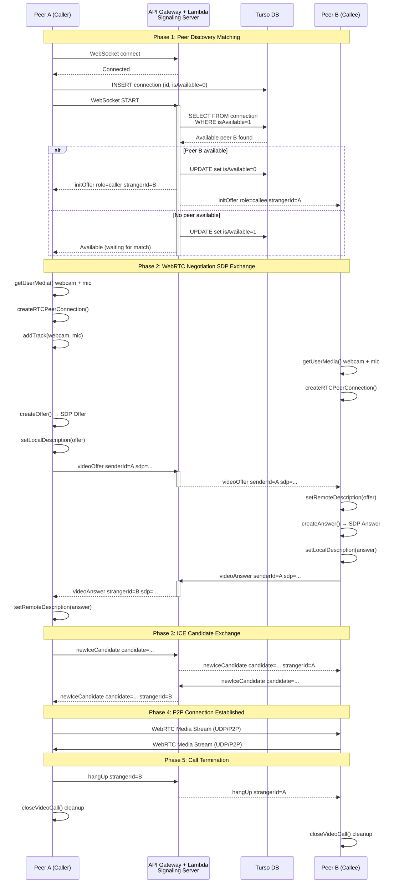

# WebRTC Video Chat Flow Chart

## Architecture Overview

---

## Message Flow Details

| Step | Message | Direction | Description |
|------|---------|-----------|-------------|
| 1 | `START` | Client → Server | Request peer matching via WebSocket |
| 2 | `initOffer + role` | Server → Both Peers | Assign roles (caller/callee) with strangerId |
| 3 | `videoOffer (SDP)` | Caller → Server → Callee | SDP offer with media capabilities |
| 4 | `videoAnswer (SDP)` | Callee → Server → Caller | SDP answer accepting connection |
| 5 | `newIceCandidate` | Both → Server → Both | NAT traversal ICE candidates exchanged |
| 6 | `video stream` | Peer ↔ Peer (P2P) | Direct WebRTC media stream (UDP) |
| 7 | `hangUp` | Either → Server → Other | Terminate call and cleanup |

---

## Detailed Sequence Diagram

---

## WebSocket Lambda Handlers Reference

### Peer Matching (ws-start)
- **Route**: `START` action
- **Logic**: Query Turso DB for available peer (`WHERE isAvailable=1`). If found, mark both as unavailable and send `initOffer` to both with role assignment. Otherwise, set sender as `isAvailable=1` to wait.

### SDP Forwarding (ws-video-offer / ws-video-answer)
- **Routes**: `videoOffer`, `videoAnswer` actions
- **Logic**: Look up callee's connectionId by caller's peerId in DB, then post SDP to their WebSocket endpoint via API Gateway `postToConnection`

### ICE Candidate Forwarding (ws-new-ice-candidate)
- **Route**: `newIceCandidate` action
- **Logic**: Similar to SDP forwarding - look up target connectionId and forward the candidate

### Call Termination (ws-hang-up)
- **Route**: `hangUp` action
- **Logic**: Notify peer of hangup, clean up DB record

### Connection Lifecycle (ws-connect / ws-disconnect)
- **Routes**: `$connect`, `$disconnect` events
- **Logic**: Insert/remove connection records from the `connection` table on connect/disconnect