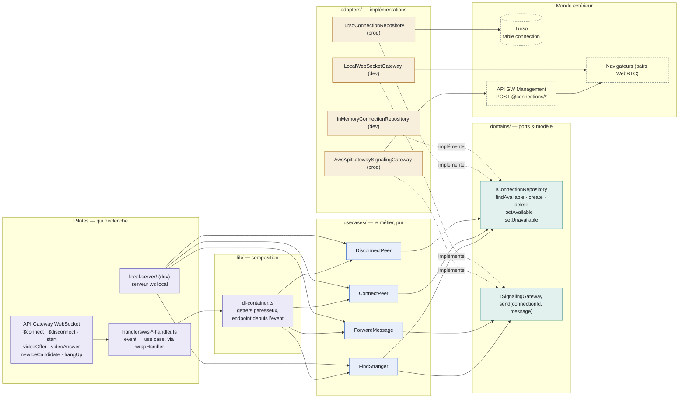
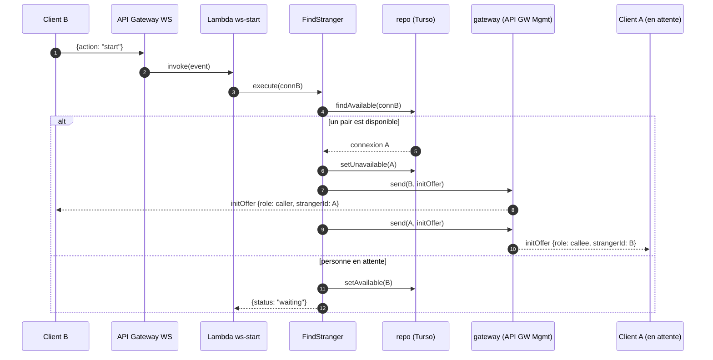

# `signaling-ws` — Architecture Ports & Adapters

Sept Lambdas WebSocket partagent un même cœur métier. Le domaine définit des contrats
(les **ports**), les use cases les consomment sans savoir qui les implémente, et les
**adapters** branchent le monde réel — Turso, API Gateway — ou des doublures locales pour le dev.

> **7** routes WS · **4** use cases · **2** ports · **4** adapters (2 prod / 2 dev) · runtime `nodejs20.x` / arm64

---

## La carte : qui appelle qui

Chaque bloc correspond à un dossier de `src/`. Les flèches pleines sont les appels à
l'exécution ; les flèches pointillées signifient « implémente ».



La flèche « implémente » est le cœur du pattern : les adapters dépendent de `domains/`,
jamais l'inverse. Le domaine ne connaît ni AWS, ni Turso, ni même l'existence des Lambdas —
il n'importe que les types `Message` de `@repo/signaling-types`.

---

## Règles de dépendance : ce que chaque brique a le droit d'importer

C'est cette règle qui rend le cœur testable et les adapters remplaçables. Toutes les
flèches d'import convergent vers `domains/`.

| Brique | Rôle | Importe | N'importe jamais |
|---|---|---|---|
| `domains/` | Modèle `Connection` + les 2 ports (interfaces pures) | `@repo/signaling-types` uniquement | use cases, adapters, SDK |
| `usecases/` | Logique de matching et de relais, sans I/O direct | `domains/` (les ports, en types) | un adapter concret, `@aws-sdk`, `@libsql` |
| `adapters/` | Implémentations techniques des ports | `domains/` + SDK externes (`@libsql/client/web`, `@aws-sdk`, `ws`) | use cases, handlers |
| `handlers/` | Event Lambda → use case → réponse HTTP | `lib/` (DI + `wrapHandler`) | un adapter directement |
| `lib/` | Composition root : le **seul** endroit qui connaît les adapters de prod | adapters + use cases + `aws-lambda` (types) | — |
| `ws-*/index.ts` | Points d'entrée bundlés (1 par Lambda), simples re-exports | son handler | — |
| `local-server/` | Harnais de dev : câble lui-même use cases + adapters in-memory | use cases + adapters locaux | adapters de prod |

Deux garde-fous transverses dans `lib/` :

- **`di-container.ts`** — getters paresseux : chaque Lambda ne paie que les dépendances de
  *son* use case. Le endpoint de callback vient de `event.requestContext`, pas d'une
  variable d'environnement.
- **`wrap-handler.ts`** — try/catch commun : erreur loggée avec le nom de l'action,
  réponse 500 contrôlée au lieu d'un crash opaque.

---

## Câblage route par route

Grâce au conteneur paresseux, les quatre routes de relais tournent **sans aucune variable
d'environnement**.

| Route WS | Lambda | Use case | Ports | Adapters (prod) | Env requises |
|---|---|---|---|---|---|
| `$connect` | `WebSocket_Connect` | ConnectPeer | repo | Turso | `TURSO_*` |
| `$disconnect` | `WebSocket_Disconnect` | DisconnectPeer | repo | Turso | `TURSO_*` |
| `start` | `WebSocket_Start` | FindStranger | repo + gateway | Turso + API GW Management | `TURSO_*` |
| `videoOffer` | `WebSocket_VideoOffer` | ForwardMessage | gateway | API GW Management | *aucune* |
| `videoAnswer` | `WebSocket_VideoAnswer` | ForwardMessage | gateway | API GW Management | *aucune* |
| `newIceCandidate` | `WebSocket_NewIceCandidate` | ForwardMessage | gateway | API GW Management | *aucune* |
| `hangUp` | `WebSocket_HangUp` | ForwardMessage | gateway | API GW Management | *aucune* |

Le gateway construit son endpoint depuis `event.requestContext.domainName` + `stage` —
plus besoin de `DOMAIN_NAME`/`STAGE` dans l'infra.

---

## Le flux `start` : matcher deux inconnus

Le seul scénario qui traverse les deux ports à la fois — c'est lui qui justifie l'architecture.



---

## Du source au Lambda : le trajet d'un handler

```text
src/ws-start/index.ts        re-export du handler
        │
        ▼
bundler.mjs                  esbuild · CJS · target node20 · minify + sourcemap
        │
        ▼
dist/ws-start/index.js+.map  bundle hermétique, toutes deps incluses (aucun `external`)
        │
        ▼
Pulumi FileArchive           infra/src/start-lambda.ts
        │
        ▼
λ WebSocket_Start            nodejs20.x · arm64 · handler `index.handler`
```

Les `.map` sont déployées dans le zip et lues par `NODE_OPTIONS=--enable-source-maps` :
les stack traces CloudWatch pointent sur le TypeScript, pas sur le bundle minifié.

---

## Où intervenir selon le besoin

- **Changer de base de données** — écrire un nouvel adapter de `IConnectionRepository` dans
  `adapters/repositories/`, puis changer une ligne dans `lib/di-container.ts`. Ni les use
  cases, ni les handlers ne bougent.
- **Ajouter une action WebSocket** — un handler dans `handlers/` + une entrée
  `src/ws-*/index.ts` déclarée dans `bundler.mjs` + la route côté `infra/`. Si c'est un
  simple relais, `ForwardMessage` existe déjà.
- **Tester la logique de matching** — instancier `FindStranger` avec
  `InMemoryConnectionRepository` et un faux gateway : aucun mock d'AWS nécessaire. C'est
  exactement ce que fait `local-server/` (`pnpm dev`).

---

*Schéma établi depuis le code réel de `packages/signaling-ws/src` — branche
`refactor-signaling-ws`, juillet 2026.*
