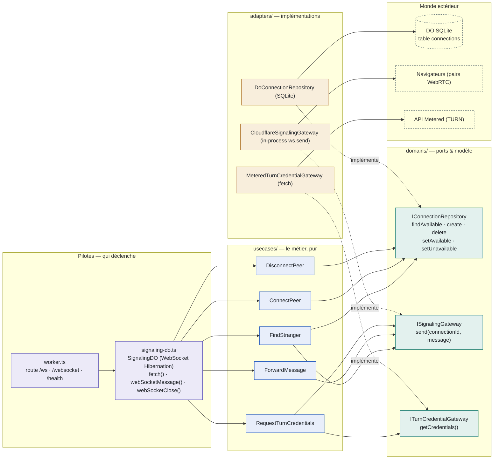
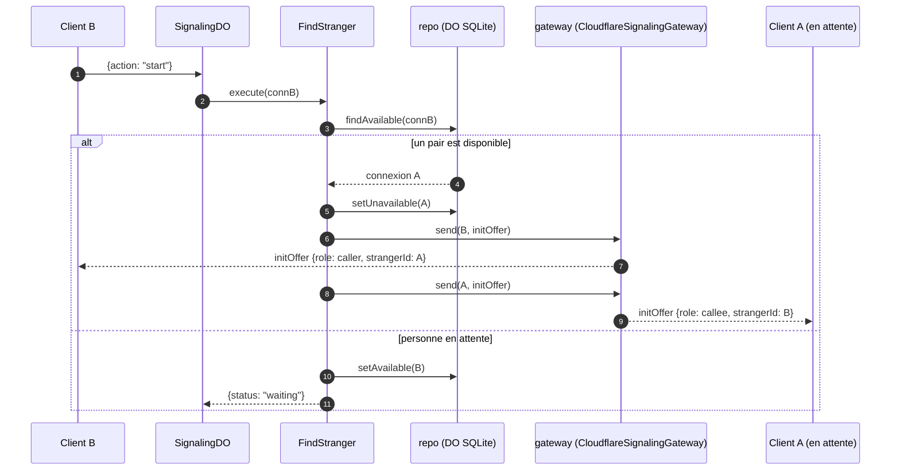

# `signaling-cf` — Architecture Ports & Adapters

Un seul Worker Cloudflare + un Durable Object (`SignalingDO`) partagent le même cœur
métier que l'ancien backend. Le domaine définit des contrats (les **ports**), les use cases
les consomment sans savoir qui les implémente, et les **adapters** branchent le monde réel —
WebSocket Hibernation, SQLite Durable Object, API Metered.

> **4** actions WS + `fetch()` + `webSocketClose()` · **5** use cases · **3** ports · **3** adapters (2 signaling + 1 TURN) · Durable Object SQLite

---

## La carte : qui appelle qui

Chaque bloc correspond à un dossier de `src/`. Les flèches pleines sont les appels à
l'exécution ; les flèches pointillées signifient « implémente ».



La flèche « implémente » est le cœur du pattern : les adapters dépendent de `domains/`,
jamais l'inverse. Le domaine ne connaît ni Cloudflare, ni Metered — il n'importe que les
types `Message` de `@repo/signaling-types`.

---

## Règles de dépendance : ce que chaque brique a le droit d'importer

Toutes les flèches d'import convergent vers `domains/` — c'est ce qui rend le cœur testable
et les adapters remplaçables.

| Brique | Rôle | Importe | N'importe jamais |
|---|---|---|---|
| `@repo/signaling-core/src/domains/` | Modèle `Connection` + les ports (interfaces pures) | `@repo/signaling-types` uniquement | use cases, adapters, SDK |
| `@repo/signaling-core/src/usecases/` | Logique de matching, relais et TURN, sans I/O direct | `domains/` (les ports, en types) | un adapter concret, `cloudflare:workers`, SDK |
| `@repo/signaling-cf/src/adapters/` | Implémentations techniques des ports | `domains/` + API Durable Object | use cases, handlers |
| `@repo/signaling-cf/src/signaling-do.ts` | Composition root : câble les use cases avec les adapters, fait la bascule sur `action` | adapters + use cases + `cloudflare:workers` | — |
| `@repo/signaling-cf/src/worker.ts` | Entrypoint HTTP : route `/ws`, `/websocket`, `/health` vers le stub DO | `signaling-do.ts` (types + classe DO) | — |

Le Durable Object fait office de **composition root unique** : contrairement aux Lambdas
(une composition par handler), le constructeur câble une fois use cases et adapters.

---

## Câblage entrée par entrée

Le `SignalingDO` expose trois hooks de cycle de vie, tous branchés sur le même jeu d'adapters.

| Entrée | Hooks | Use case | Ports | Adapters (prod) | Env requises |
|---|---|---|---|---|---|
| `GET /ws` (upgrade) | `fetch()` | ConnectPeer | repo | DoConnectionRepository | — |
| `WS message` `start` | `webSocketMessage()` | FindStranger | repo + gateway | DO SQLite + Cloudflare gateway | — |
| `WS message` `videoOffer` / `videoAnswer` / `newIceCandidate` / `hangUp` | `webSocketMessage()` | ForwardMessage | gateway | Cloudflare gateway | — |
| `WS message` `requestTurnCredentials` | `webSocketMessage()` | RequestTurnCredentials | gateway TURN + signaling | Metered + Cloudflare gateway | `METERED_*` |
| `WS close` | `webSocketClose()` | DisconnectPeer | repo | DO SQLite | — |
| `GET /health` | `fetch()` | — | repo | DO SQLite | — |

Le gateway retrouve la WebSocket cible via `ctx.getWebSockets()` + l'`attachment`
(`connectionId`), puis appelle `ws.send()` en process — aucun aller-retour HTTP par message.

---

## Le flux `start` : matcher deux inconnus

Le seul scénario qui traverse les deux ports à la fois — c'est lui qui justifie l'architecture.



L'atomicité du matching vient des input gates du Durable Object : `findAvailable` +
`setUnavailable` s'exécutent sans interleaving, ce qui élimine la course au matching que
deux `START` concurrents créaient avec la base distante.

---

## Cycle de vie d'une WebSocket dans le Durable Object

```text
worker.ts (route /ws)
        │  request Upgrade
        ▼
stub SIGNALING_DO.fetch(request)     → DoConnectionRepository: CREATE TABLE IF NOT EXISTS
        │  acceptWebSocket(server) + serializeAttachment({ connectionId })
        ▼
ConnectPeer.execute(connectionId)    → INSERT connection (id, is_available=0)
        │
        ▼
webSocketMessage(ws, message)        → JSON.parse → dispatch sur msg.action
        │  (START → FindStranger · video*/hangUp → ForwardMessage · TURN → RequestTurnCredentials)
        ▼
webSocketClose()                     → DisconnectPeer.execute(connectionId) → DELETE row
```

`ctx.storage.sql` est synchrone et co-localisé : aucune latence réseau pour lire/écrire
l'état de matching, et pas de connexion externe à gérer.

---

## Où intervenir selon le besoin

- **Changer de base de données** — écrire un nouvel adapter de `IConnectionRepository` dans
  `@repo/signaling-cf/src/adapters/repositories/`, puis changer le constructeur du DO. Ni les
  use cases, ni le worker ne bougent.
- **Ajouter une action WebSocket** — un `case` dans `webSocketMessage()` ; si c'est un simple
  relais, `ForwardMessage` existe déjà.
- **Tester la logique de matching** — instancier `FindStranger` avec un repo in-memory et un
  faux gateway : aucun mock de Cloudflare nécessaire. C'est le même cœur métier testé
  unitairement depuis l'époque des Lambdas.

---

*Schéma établi depuis le code réel de `packages/signaling-cf/src` — après décommission d'AWS
(`packages/signaling-ws` + `infra`), juillet 2026.*
